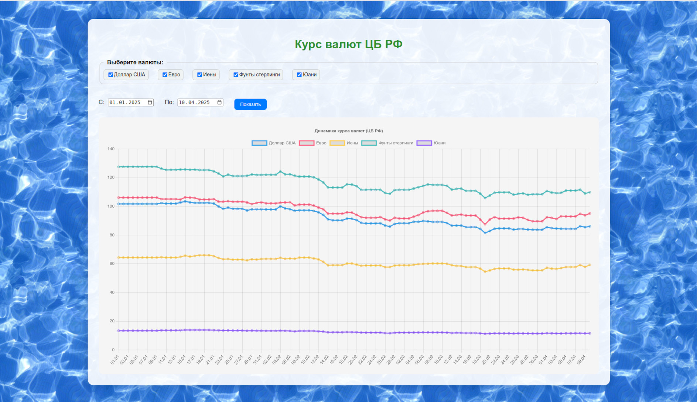

# Bottle Currency — Курсы валют ЦБ РФ
Проект на Python с использованием фреймворка Bottle для получения, кэширования и визуализации курсов валют, предоставляемых Центробанком РФ. Данные отображаются в виде графиков с возможностью выбора валют и диапазона дат.


## 🔧 Функциональность:
- График изменения курса валют с помощью Chart.js
- Фильтрация по диапазону дат
- Выбор валют через чекбоксы
- Хранение данных в SQLite с кэшированием через Peewee
- Логирование всех действий и ошибок

## ⚙️ Установка и запуск
```bash
git clone https://gitverse.ru/Rockdukan/bottle-currency.git
cd bottle-currency
uv venv
uv run main.py
```
